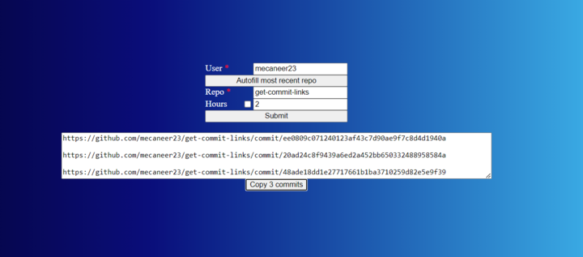

# Get Commit Links

Fetch public links to most recent git commits locally



## Usage

Run in a terminal in the same directory as your git repository. By default, get commits from the last two hours.

## Options

If running with Python, optionally specify an amount of commits to fetch.

Example: fetching the 3 most recent commits in the current working directory

```bash
python3 get_url.py 3
```

Specify a negative number to fetch commits since `-n` hours ago

```bash
# getting commits from the last 2 hours
python3 get_url.py

# getting commits from the last 5 hours
python3 get_url.py -5
```
